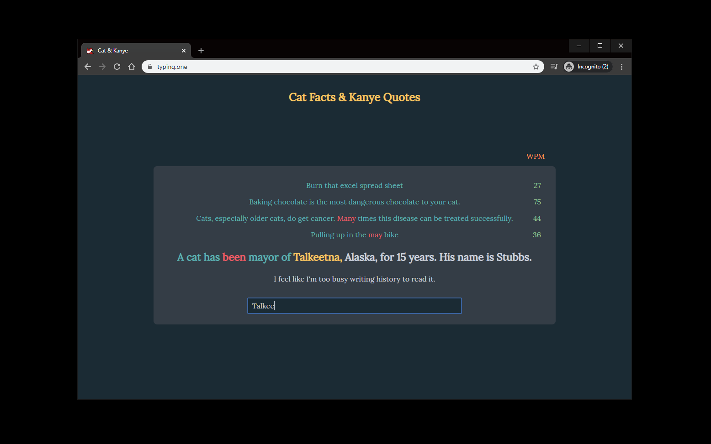

# typing.one
### What is it?
<a href="https://typing.one" target="_blank">typing.one</a> is a website to practice typing. 
 

### Why did I make it?
* To type on my new keyboard. 
* Many typing websites don't look good enough. I love the design of <a href="https://typings.gg" target="_blank">typings.gg</a>, but also wanted to type meaningful(?) sentences instead of random words. 
* To try React hooks. 
### How does it work?
It consumes 2 public API, <a href="https://alexwohlbruck.github.io/cat-facts" target="_blank">Cat facts</a> and <a href="https://kanye.rest" target="_blank">Kanye quotes</a>. 
You need to type out some facts about cats or quotes from Kanye. How fun! 

